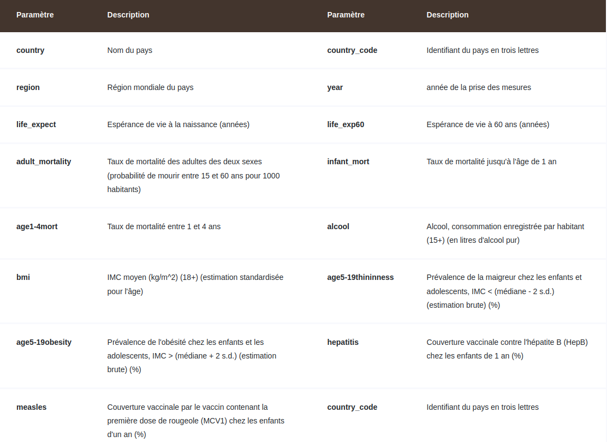
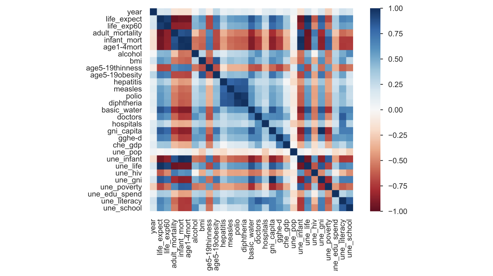
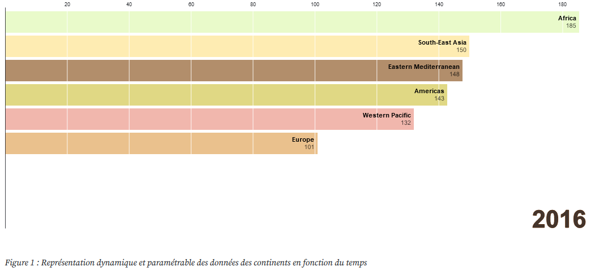
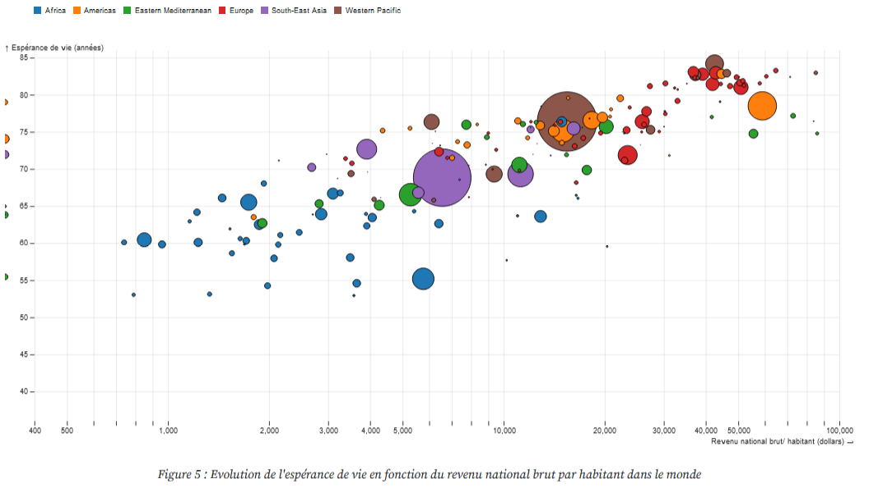

<h1>Exploration interactive de l'espérance de vie de 2000 à 2016</h1>

L'espérance de vie est un indicateur clé de la santé et du bien-être des populations. Depuis les années 2000, nous avons assisté à des améliorations significatives de l'espérance de vie dans de nombreux pays du monde. Cependant, il existe encore des disparités importantes entre les pays et les régions. Cela a stimulé notre désir de mieux comprendre cette problématique.

Notre projet invite les data scientists ou tout autre personne intéressée par le sujet, à explorer ces tendances à travers une visualisation interactive de l'espérance de vie de différents pays et régions à travers les années 2000 à 2016. Il est également possible d'explorer les données selon d'autres critères corrélés à l'espérance de vie (positivement ou négativement) tels que la mortalité infantile, l'alphabétisation, le PIB et plus encore.  
En résumé, nous nous posons la question : Quels sont les facteurs qui impactent l'espérance de vie entre les continents? Et pour répondre à notre problématique, on étudiera en premier lieu le classement des continents par rapport à l'espérance de vie. Ensuite, on se focalisera sur la représentation de l'espérance de vie par pays. Enfin nous expliquerons les facteurs qui impactent sur la variation.  
Nous utilisons un dataset riche d'informations et de données relatives relatives à vaccination contre les virus, les indices de développement des pays incluant: les taux de pauvreté, le PIB ainsi que le taux d'alphabétisation et scolarisation dans les populations. 

 
 

Nous avons étudié les facteurs qui impactent sur l'espérance de vie. 
<ul>
  <li>
    Economiques: concerne les revenus nationaux bruts par habitant, les dépenses économiques sur les domaines vitaux: santé et éducation et la lutte contre la pauvreté .</li>
  <li>  Sanitaires : exprimé par les taux de vaccination contre les virus et différentes épidémis notament: VIH, Hépatite, Diphtéria, poliomyélite et la rougeole ainsi que l'accès aux soins médicaux et les différentes installations sanitaires.</li>
  <li>  Environnementaux: concerne l'accès et salubrité des eaux potables.</li>
  <li>  Sociaux : représentés par le taux d'alphabétisation des citoyens et le nombre moyen des années de scolarité chez les jeunes moins de 25 ans ainsi que les taux de consommation de l'alcool.</li>
   <li> Qualité de vie: exprimée par les habitudes consommatrices des citoyens reprénsentées par l'indice de l'IMC,taux d'obésité et de minceur chez les jeunes et consommation d'alcool.
</li>
</ul>

Plus précisément, nous avons mené une étude exploratoire sur les données pour déterminer les corrélations entre les différents facteurs et l'espérance de vie.Ceci est présenté dans la matrice de corrélation suivante.  

  

Les visualisations suivantes représentent l'évolution de l'espérance de vie en fonction de plusieurs facteurs dans tous les continents. 

  
  

Pour se faire, nous avons utilisé javascript et la bibliothèque D3 afin de réaliser des visualisations dynamiques et paramétrables qui représentent les facteurs impactant sur l'évolution de l'espérance de vie au fil de temps.  

Vous trouverez le code source, l'ensemble des visualisations et explorations ainsi que les interprétations et résultats dans le fichier Observable suivant: https://observablehq.com/d/0265d280bc81e176

